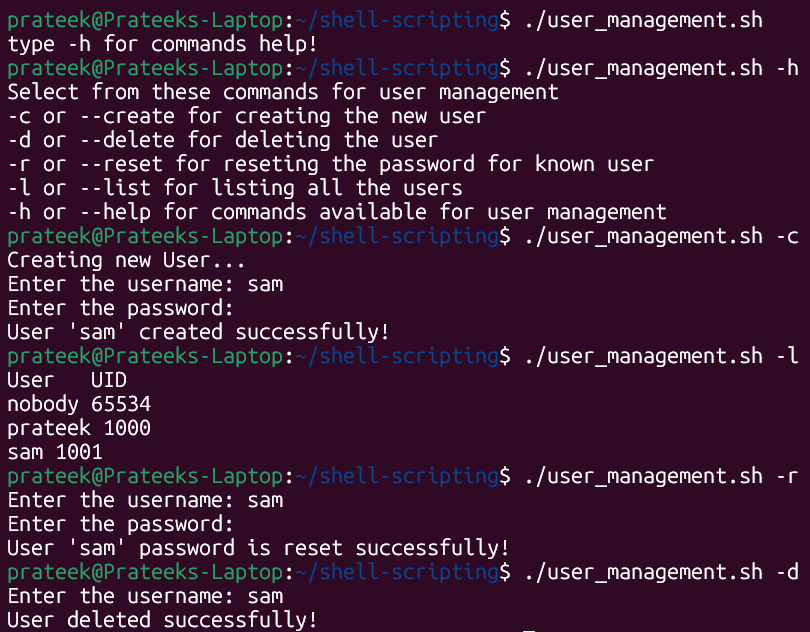

# Shell Scripting Solutions

This directory contains shell scripts developed as part of DevOps learning journey.

### **Task** - [90DaysOfDevOps Shell Scripting Challenge](https://github.com/LondheShubham153/90DaysOfDevOps/tree/master/2025/shell_scripting)

## Task 1 - User Management Script (`user_management.sh`)

A Bash script that provides user account management functionality in Linux systems.

### Usage
```bash
# Run the script with sudo privileges
sudo ./user_management.sh
```

### Output



---


## Task 2 - Backup Rotation Script (`backup_with_rotation.sh`)
A Bash script that implements an automated backup system with 5-day rotation policy.

### Features
- Creates timestamped ZIP backups of specified directories
- Implements 5-day rotation policy to manage storage
- Automatic cleanup of old backups
- Error handling and logging

### Usage
```bash
./backup_with_rotation.sh <source_path> <destination_path>
```

### How it works
1. **Backup Creation**
   - Creates ZIP archive with timestamp
   - Validates source and destination paths
   - Provides success confirmation

2. **Rotation Management**
   - Maintains last 5 backups
   - Automatically removes older backups
   - Uses timestamp-based sorting

### Example
```bash
./backup_with_rotation.sh /path/to/source /path/to/backup/storage
```
